# Image Analysis TIFF Viewer Guide

This guide provides step-by-step instructions on how to use the image analysis TIFF viewer, including launching the application, opening files, setting parameters, and analyzing data.

<!-- add table of contents -->

## Table of Contents

- [Image Analysis TIFF Viewer Guide](#image-analysis-tiff-viewer-guide)
  - [Table of Contents](#table-of-contents)
  - [microEye Launcher](#microeye-launcher)
    - [Usage](#usage)
    - [Terminal](#terminal)
  - [1. Starting the Launcher from CMD](#1-starting-the-launcher-from-cmd)
  - [2. Launching the TIFF Viewer](#2-launching-the-tiff-viewer)
  - [3. Opening a TIFF or Zarr Stack](#3-opening-a-tiff-or-zarr-stack)
  - [4. Stack Viewer](#4-stack-viewer)
    - [Time Axis Slider](#time-axis-slider)
    - [Intensity Histogram](#intensity-histogram)
    - [Options](#options)
    - [Filters](#filters)
    - [**Pre-Fit**](#pre-fit)
    - [**Localization**](#localization)
  - [5. Real-Time Preview Before Fitting the Data](#5-real-time-preview-before-fitting-the-data)
  - [6. Fitting/Localization of Data](#6-fittinglocalization-of-data)
  - [7. Localization View and Analysis](#7-localization-view-and-analysis)
    - [Localization Tab](#localization-tab)
    - [Export and Import](#export-and-import)
    - [Statistics and Visualization](#statistics-and-visualization)
    - [Data Filters Tab](#data-filters-tab)
    - [Layers Tab](#layers-tab)
  - [8. Localizations Analysis](#8-localizations-analysis)

## microEye Launcher

The microEye Launcher allows you to launch either the `miEye Module` or the `Viewer Module`, and provides options to select the Qt API and theme for the application.


### Usage

Upon running the launcher, you will be presented with the following interface:

- **miEye Module**: Launches the miEye module for microscope control and acquisition.
- **Viewer Module**: Launches the viewer module for image/data anlysis and visualization.
- **QT API (dropdown)**: Select the Qt API to use. Options are PySide6, PyQt6, or PyQt5.
- **Theme (dropdown)**: Select the theme for the application. Options are None (default), qdarktheme, or qdarkstyle.

To launch a module, simply click on the respective button (`miEye Module` or `Viewer Module`). If you wish to change the Qt API or theme, select the desired option from the dropdown menus before launching.

### Terminal

```powershell
   usage: microEye.exe [-h] [--module MODULE] [--QT_API QT_API] [--theme THEME]

   optional arguments:
    -h, --help            show this help message and exit
    --module {mieye,viewer}
                          The module to launch [mieye|viewer], If not specified, launcher is executed.
    --QT_API {PySide6,PyQT6,PyQt5}
                          Select QT API [PySide6|PyQT6|PyQt5], If not specified, the environment variable QT_API is used.
    --theme {None,qdarktheme,qdarkstyle,...}
                          The theme of the app, if not specified, the environment variable MITHEME is used.
```

You can use the terminal as an alternative to the GUI launcher for launching the microEye application and its modules. The terminal provides the same functionality as the GUI launcher but allows you to specify options directly through command-line arguments. For example:

To launch the viewer module, you can run:

```PowerShell
microEye --module viewer
```

To specify additional options like the Qt API or theme, you can include them as arguments:

```PowerShell
microEye --module viewer --QT_API PySide6 --theme qdarktheme
```

## 1. Starting the Launcher from CMD

To start the launcher from the command line:

1. Open the Command Prompt (CMD) by pressing `Win + R`, typing `cmd`, and pressing `Enter`.
2. Launching:

   **A) Terminal:** Run the following command to launch the microEye launcher application:

   ```PowerShell
   microEye --module viewer
   ```

   **B) Launcher Interface:** Using the launcher

   ```PowerShell
   microEye
   ```

   

## 2. Launching the TIFF Viewer

Once the application is running, the TIFF viewer will be launched automatically if the `viewer` module is selected.

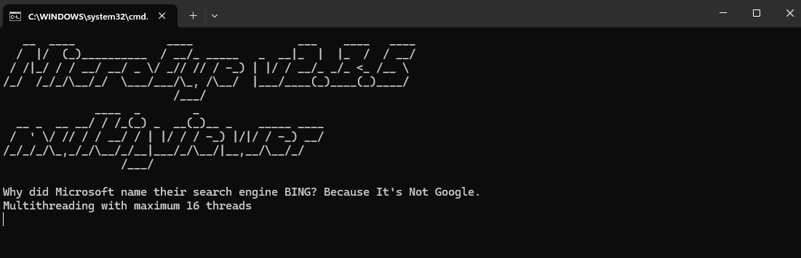
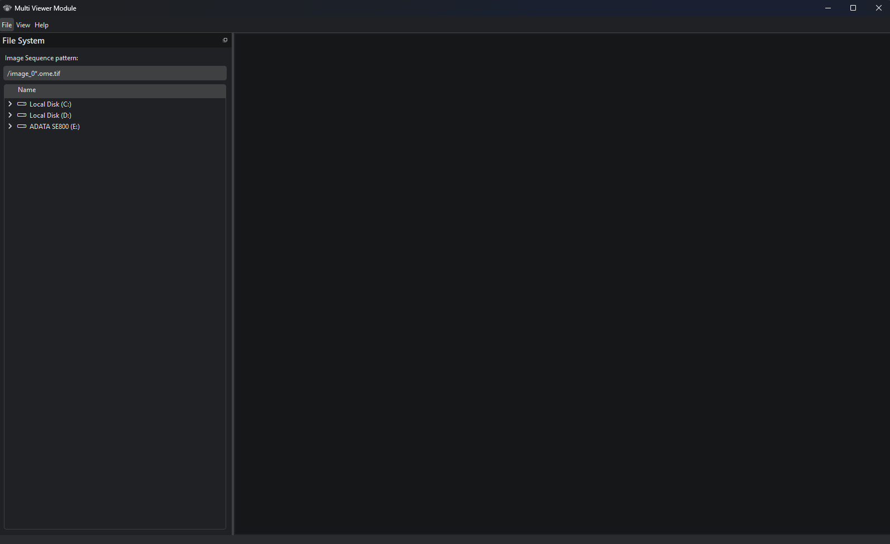

## 3. Opening a TIFF or Zarr Stack

To open a TIFF or Zarr stack:

1. Browse to the location of your TIFF or Zarr file using the file system tree.

   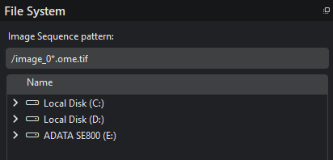

2. Select the file and double click it to "Open". The stack will be loaded into the viewer.

## 4. Stack Viewer

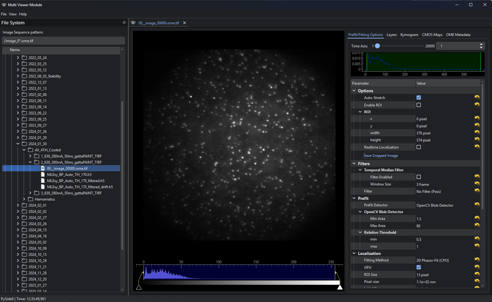

### Time Axis Slider

Use the time axis slider to navigate and preview individual frames seamlessly.

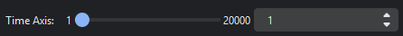

_Note: For multi-dimensional stacks, additional sliders such as the Z-axis or channel sliders will appear._

### Intensity Histogram

The intensity histogram visually represents the distribution of pixel intensities within the image.

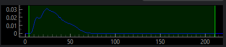

_Note: If `Auto-Stretch` is disabled, the linear region is used to define the intensity stretching levels._

### Options

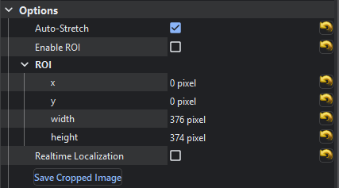

The TIFF viewer provides several configurable options to enhance your image analysis workflow:

- **Auto-Stretch**: Automatically adjusts the intensity range of the image for optimal visualization. This feature dynamically stretches the intensity levels to improve contrast.

- **Enable ROI**: Activates the Region of Interest (ROI) selection tool, allowing you to define a specific area of the image for analysis.

- **ROI**: Displays the currently selected Region of Interest. You can adjust the ROI by dragging its edges or corners to resize or reposition it.

  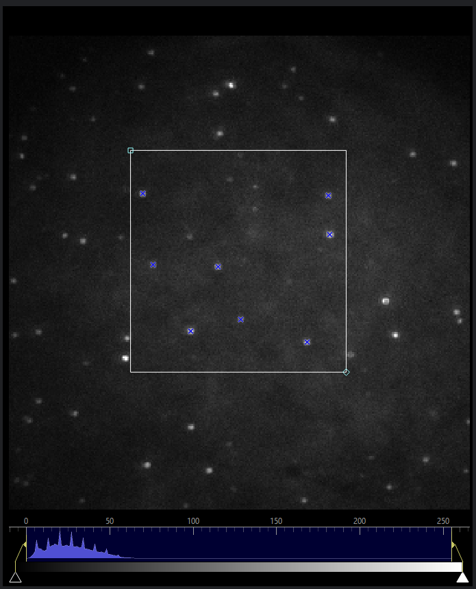

- **Real-Time Localization**: Toggles the real-time localization feature. When enabled, the software continuously updates the localization results as you adjust parameters or interact with the image.

- **Save Cropped Image**: This option allows you to save the currently selected ROI as a cropped image for further analysis or documentation.

### Filters

The TIFF viewer includes filtering options to enhance pre-fit detection and reduce noise.

- **Temporal Median Filter**

  The Temporal Median Filter is a noise reduction technique used for temporal median background subtraction in time-lapse image stacks. It calculates the median intensity value for each pixel over a specified temporal window and subtracts it from the pixel's intensity. This process effectively removes static or repetitive background noise while preserving dynamic events and transient features, ensuring clearer and more accurate data for analysis.

  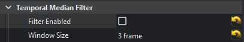

  _Note: You can adjust the temporal window size in the settings to control the degree of noise reduction. Larger window sizes may require more computational resources._

- **Filter**

  The TIFF viewer provides several spatial filtering options to enhance image quality and reduce noise. These filters are designed to highlight specific features or remove unwanted artifacts, enabling more accurate analysis:

  

  - **No Filter (Pass):** Leaves the image unaltered, bypassing any filtering.
  - **Difference of Gaussians (DoG):** Enhances edges and fine details by subtracting one blurred version of the image from another.

    **Parameters:**

    - Adjust the sigma values for the two Gaussian blurs to control the level of detail enhancement.

      $\sigma_2 = \textrm{Factor} \cdot \sigma_1$

    

  - **Fourier Filter:** Applies frequency-based filtering with the following profiles:

    - **Low Pass:** Retains low-frequency components, smoothing the image.
    - **Band Pass:** Preserves a specific range of frequencies, isolating features of interest.
    - **High Pass:** Retains high-frequency components, emphasizing edges and fine details.
    - Profiles include **Ideal**, **Butterworth**, and **Gaussian**.

    **Parameters:**

    - For Low/High Pass $F_{\textrm{center}}$ is the cutton or cutoff frequency.
    - For Band Pass the band is $F_{\textrm{center}} \pm \frac{Width}{2}$.

    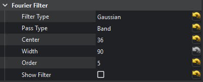

  - **Background Reduction:** Removes background noise using techniques such as:

    - **Rolling Ball:** Subtracts a smoothed background estimated by a rolling ball algorithm.
    - **White Hat:** Enhances bright features on a dark background.

    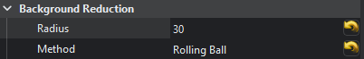

### **Pre-Fit**

The Pre-Fit feature utilizes OpenCV's BlobDetector to approximate the positions of single-molecule blinking events. Users can specify the minimum and maximum blob area in pixels to filter detections based on size. Since detection is performed on a thresholded, filtered image, the relative threshold limits can also be adjusted to optimize results for the selected data stack. This ensures accurate detection tailored to the characteristics of the dataset.

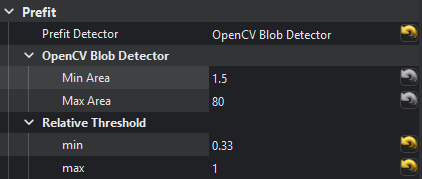

### **Localization**

- **Fitting Methods**:
  Choose the desired fitting method for localization from the available options.

  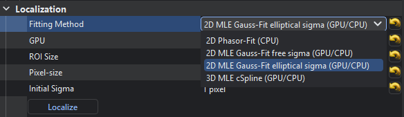

  _Note: The 3D cSpline method is currently under development and not yet functional._

  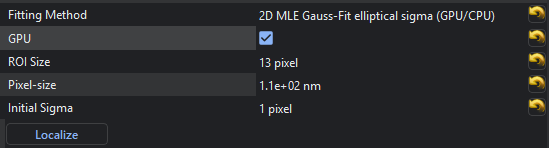

- **GPU**:  
  Enable GPU acceleration for faster localization processing. This option leverages CUDA-compatible GPUs to significantly speed up computations, especially for large datasets.

  _Note: If this option is enabled but no compatible CUDA GPU is detected, the system will default to CPU processing._

- **ROI Size**:  
  Define the size of the Region of Interest (ROI) used for fitting. A larger ROI captures more context around each point but may increase processing decrease accuracy.

- **Pixel-Size**:  
  Specify the physical size of each pixel in nanometers. This parameter is critical for accurate localization and downstream analysis.

- **Initial Sigma**:  
  Set the initial estimate for the point spread function (PSF) width (sigma) in pixels. This value helps the fitting algorithm converge more effectively.

- **Localize**:  
  Start the localization process. The software will analyze the selected data stack, apply the chosen fitting method, and generate a list of localized points with their corresponding parameters.

  - When exporting the results, an export options dialog will appear. It is recommended to uncheck the "Super-Resolution Image" option for better performance and saving storage.
  - Additionally, exporting in **HDF5 (h5)** format is recommended over **TSV**, as it saves storage space and retains higher precision in the data.

  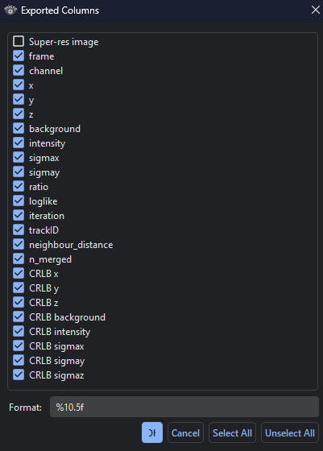

  Progress of the ongoing process is displayed in the terminal associated with the application. This includes updates on the current step, estimated time remaining, and any relevant status messages.

  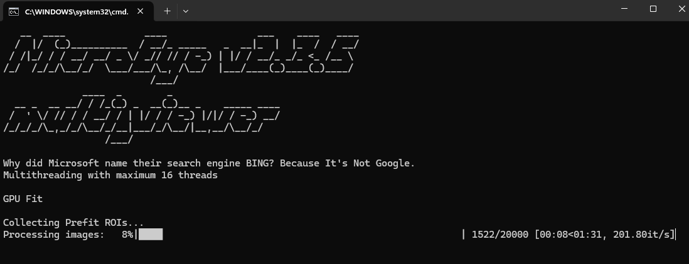

## 5. Real-Time Preview Before Fitting the Data

Before performing fitting, you can set the following parameters:

1. **Region of Interest (ROI):**
   Define the specific area of the image to analyze by selecting or adjusting the ROI. This ensures that the analysis is focused on the desired region within the image stack.

   _Note: This step is optional, particularly if your field of view (FOV) is small._

2. **Enable Real-Time Localization:**  
   Activate the real-time localization feature to preview localization results dynamically as you adjust parameters. This allows you to fine-tune settings and observe their impact on the analysis in real-time.

   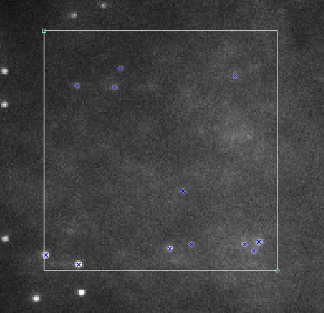

   _Important! After enabling `Real-Time Localization`, experiment with all filters and parameters as needed. Use the axis sliders to navigate through the data and observe how the localization behaves across the entire dataset. Adjust the settings iteratively to achieve optimal results for your specific analysis._

3. **Filters:**  
   Most filters are pre-configured to work effectively with their default parameters, making them easy to use right away. For beginners, the `Difference of Gaussians (DoG)` filter is a great starting point as it enhances edges and fine details, providing a clear visualization of features in the image.

4. **Thresholds:**  
   Typically, only the minimum relative threshold is adjusted to optimize localization. In rare cases, you may also need to modify the maximum threshold to refine the results.

   _Note: Gradually adjust the lower limit using the mouse wheel until all valid localizations are detected without introducing artifacts or noise into the analysis._

5. **Blob Area:**
   Set the minimum and maximum blob area in pixels to filter detections by size. Out-of-the-box settings work well, but you can adjust these limits if needed to account for noise or dataset-specific variations.

6. **Localization Options:**

   - **Localization Method**:  
     Choose the appropriate localization method, such as 2D Gaussian or 2D Elliptical Gaussian, based on the dimensionality and complexity of the data.
   - **ROI Size**:  
     Set the Region of Interest (ROI) size in pixels. The setting of 9 or 11 pixels is sufficient for most cases.
   - **Pixel Size**:  
     Define the projected size of each pixel in nanometers.
   - **Sigma Initial Guess**:  
     leave this to 1 pixel if you do not know the approximate size of the point spread function (PSF). Adjust this value only if you have prior knowledge about the PSF size in your dataset.

## 6. Fitting/Localization of Data

To perform fitting and localization:

1. Click the "Localize" button to initiate the localization process. A dialog will appear, allowing you to select the columns to export, followed by a save file dialog. Choose the HDF5 (`.h5`) format and name the file `Loc.h5`.

   

2. Monitoring Progress: the terminal displays updates on the current step, estimated time remaining, and status messages during processing.

   

3. The software will process the data stack, save the results to disk, and automatically open a new `Localization View` tab with the loaded results.

## 7. Localization View and Analysis

The Localization View provides tools for analyzing and visualizing the results of the localization process. This section explains the key features and functionalities available in the Localization View.

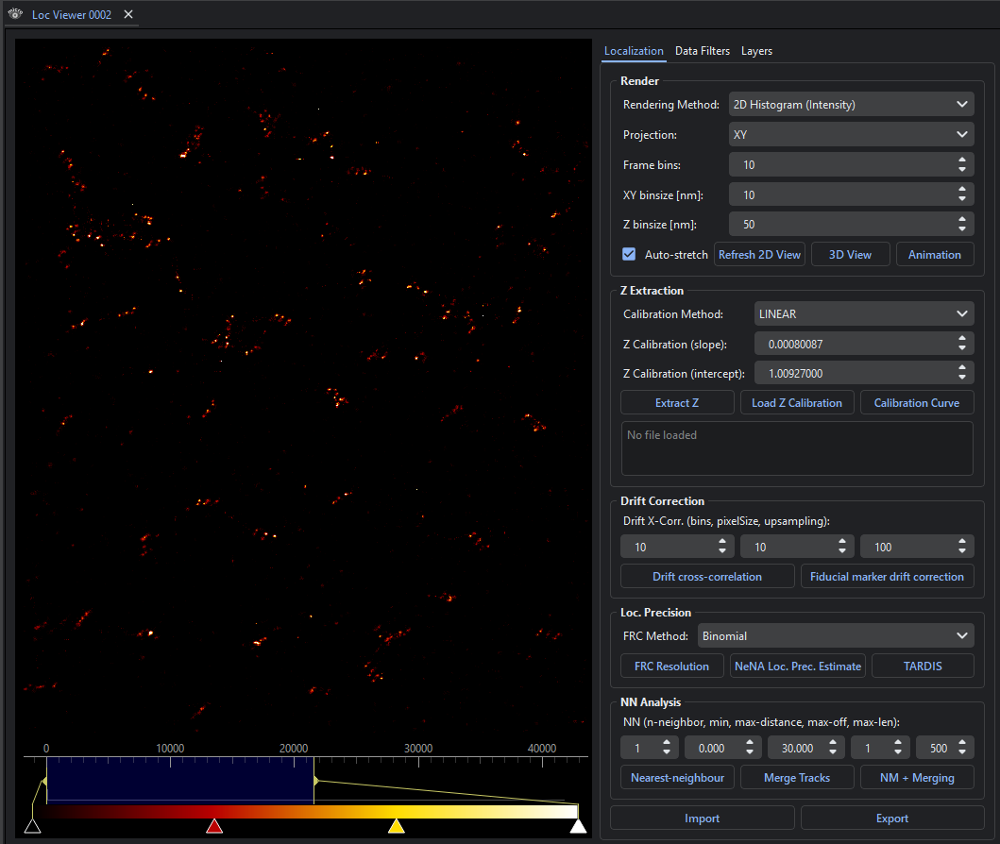

### Localization Tab

The Localization tab includes tools for rendering and analyzing localization data.

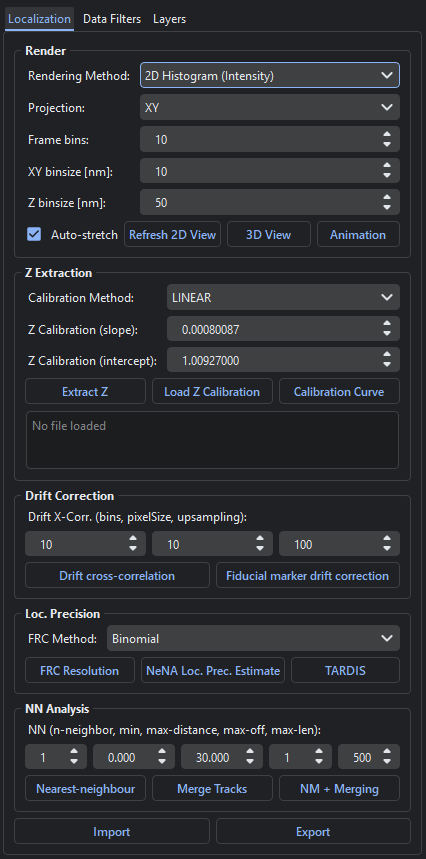

- **Rendering Options**:

  - **2D Histogram (Intensity)**: Visualize the intensity distribution of localizations.
  - **2D Histogram (Events)**: Display the number of events in each bin.
  - **2D Gaussian Histogram**: Render a Gaussian-smoothed histogram.
  - **3D View**: Generate a 3D point cloud visualization of the localizations.
  - **Animation**: Create an animation of the localization data over time.

- **Projection Options**:

  - **XY, XZ, YZ**: View projections of the data along different axes.
  - **Slice Projections**: Focus on specific slices of the data.

- **Drift Correction**:

  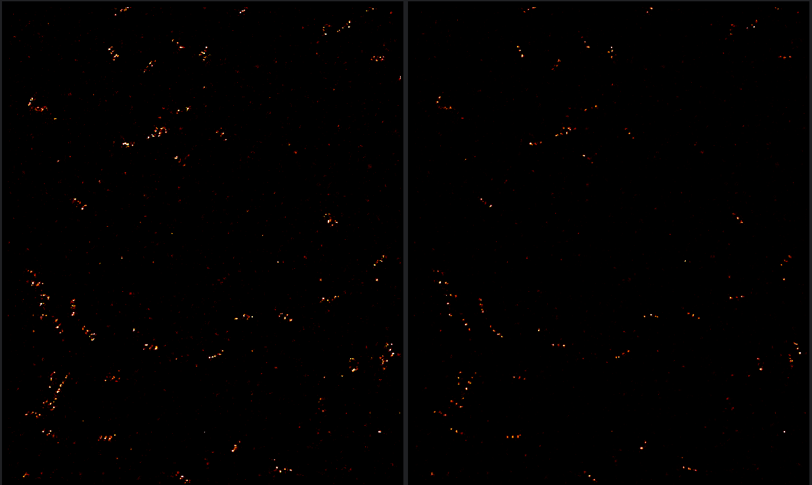

  - **Cross-Correlation**: Correct drift using cross-correlation of frames.

    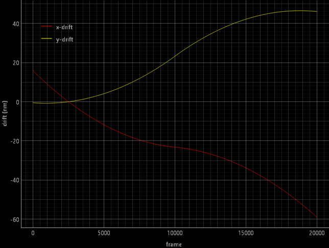

  - **Fiducial Markers**: Use fiducial markers for precise drift correction.

- **Z Extraction**:

  - Extract Z-coordinates using calibration curves (linear or cubic spline).
  - Load Z calibration files and visualize the calibration curve.

- **Localization Precision**:

  - **FRC Resolution**: Estimate resolution using Fourier Ring Correlation.

    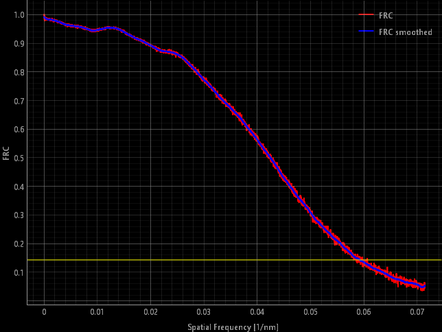

  - **NeNA Precision**: Perform Nearest-Neighbor Analysis for localization precision.

    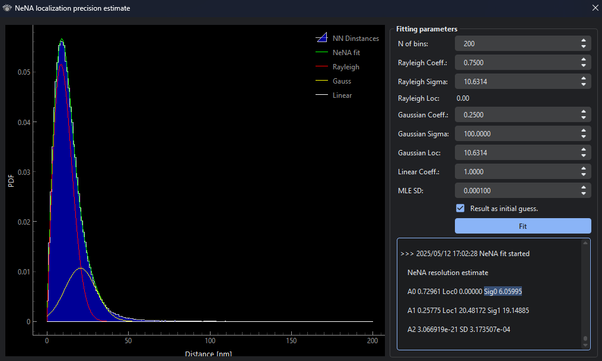

  - **TARDIS Basic Analysis**:

    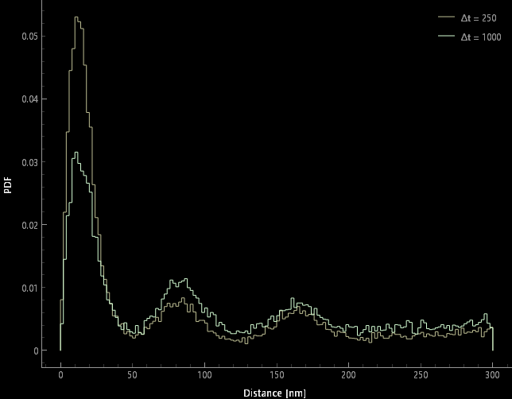

### Export and Import

- **Export Results**: Save localization results in HDF5 or TSV formats. You can also export rendered super-resolution images.
- **Import Results**: Load previously saved localization results for further analysis into a new layer.

### Statistics and Visualization

- **Statistics**: View summary statistics of the localization results, including the total number of localizations and filtered results.
- **Visualization**: Use scatter plots, histograms, and trajectory plots to explore the data.

### Data Filters Tab

The Data Filters tab provides tools to refine and analyze localization results.

- **Apply Filters**: Use filters to exclude outliers or focus on specific subsets of data.
- **Zero Coordinates**: Reset the coordinates of the localization results to a origin.

  $x_{origin} = X - \min(X)$

  $y_{origin} = Y - \min(Y)$

- **Shift Data**: Shift the localization data along the X, Y, or Z axes by a specified amount.
- **Track Plots**: Filters out data without a `Track ID`.

  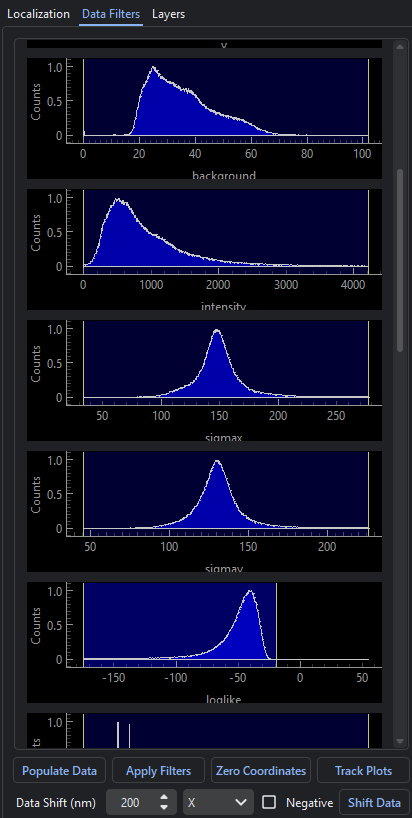

### Layers Tab

You can import localization files from other channels to overlay and analyze them together, utilizing the layers functionality for better visualization and comparison.

- **Layer Management**: You can toggle the visibility of layers, adjust their opacity, or change the composition mode.
- **Selected Layer**: Filters and analysis tools apply only to the active layer. Select the desired layer before making changes to ensure accurate results.

  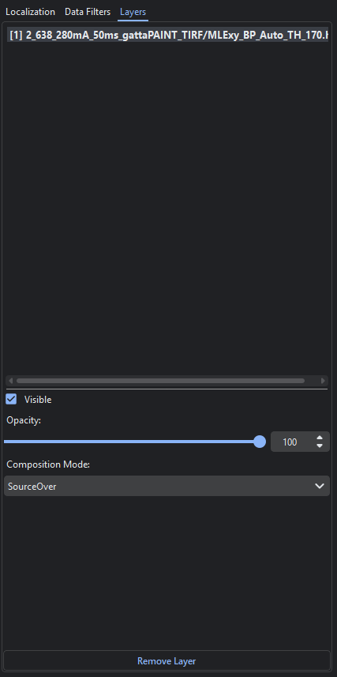

## 8. Localizations Analysis

1. Navigate to the `Data Filters` tab and click on `Populate Data`.
2. To filter outliers, press `Apply Filters`. The limits will be automatically determined.
3. Press the `Export` button to save the filtered data with the suffix `_filtered.h5` appended to the original file name, ensuring the results are saved separately while maintaining a clear link to the original dataset.

   _Note: It is recommended to uncheck the "Super-Resolution Image" option unless specifically required, as this can save storage space and improve performance._

4. Drift correction:

   - **Cross-Correlation**:

     To perform drift correction using cross-correlation, follow these steps:

     1. Open the `Localization View` and navigate to the `Drift Correction` section.
     2. Set the **Number of Bins** to `5` as a starting point. Adjust this value as needed based on your dataset.
     3. Define the **Pixel Size** within the range between `7` and `30` nanometers. Start with a value of `10` nanometers for initial analysis.
     4. Run the cross-correlation analysis to estimate and correct the drift.

     **Note:**  
      If the resulting plot shows drift values in the range of kilo-nanometers, it indicates that the parameters may not be optimal. Reload the data and repeat the process with adjusted parameters for improved results.

     **Reloading Data:**  
      Navigate to the `File System` and double-click the localization `.h5` file to reload it.

   _Note: If fiducial markers are available, use them for more precise drift correction._

5. Save drift-corrected data, export it as `_drift_corrected.h5`, similar to saving filtered data in _step 3_.

6. Fourier Ring Correlation (FRC) Resolution Estimate:

   

   Ensure the pixel size satisfies the Nyquist criterion. For a target resolution of 20 nm, set the pixel size to approximately 10 nm (half the resolution).

   _Note: If the FRC resolution estimate is NaN or the curve fails to intersect the 1/7 line, adjust the pixel size in the settings before re-running the analysis._

7. Nearest-Neighbor Analysis (NeNA) Precision Estimate:

   

   NeNA is used to estimate the localization precision by analyzing the distances between neighboring localizations. This method provides a robust measure of the precision of the localization process.

   - **Procedure**:

     1. Press `NeNA Loc. Prec. Estimate` to calculate the Nearest-Neighbor Analysis (NeNA). This process may take some time to complete.
     2. Once the calculation is finished, a dialog will appear.
     3. Typically, check the option `Result as initial guess` and press the `Fit` button multiple times until the output stabilizes (i.e., remains consistent across iterations).
     4. The Rayleigh distance, denoted as $\sigma_0$, represents the precision estimate in nanometers.

This concludes the general guide for using the image analysis TIFF viewer.
