# miEye Microscope Manual

This guide provides step-by-step instructions on how to use the `miEye module`

> _Last Update 18th June 2026_

<!-- add table of contents -->

## Table of Contents

- [miEye Microscope Manual](#mieye-microscope-manual)
  - [Table of Contents](#table-of-contents)
  - [Starting the microscope](#starting-the-microscope)
  - [Starting the microEye software](#starting-the-microeye-software)
    - [1. Starting the miEye module](#1-starting-the-mieye-module)
    - [2. Loading configuration](#2-loading-configuration)
    - [3. Setting up the Focus Stabilization NIR camera](#3-setting-up-the-focus-stabilization-nir-camera)
    - [4. Setting up the Acquisition camera](#4-setting-up-the-acquisition-camera)
    - [5. Microscope stages](#5-microscope-stages)
  - [Laser Excitation Guide](#laser-excitation-guide)
    - [Switching SMF to MMF](#switching-smf-to-mmf)
    - [Single-mode fiber (Epi/HiLo/TIRF)](#single-mode-fiber-epihilotirf)
    - [Single-mode fiber Expansion](#single-mode-fiber-expansion)
      - [High Expansion](#high-expansion)
      - [Low Expansion](#low-expansion)
    - [Laser Control](#laser-control)
  - [Sample Handling](#sample-handling)
    - [Slides](#slides)
    - [Mounting](#mounting)
    - [Removing](#removing)
  - [Focus Stabilization](#focus-stabilization)
  - [Scan Acquisition](#scan-acquisition)
  - [Microscope Objective Care](#microscope-objective-care)
    - [Cleaning the oil objective](#cleaning-the-oil-objective)
  - [Switching Off the Microscope](#switching-off-the-microscope)
  - [Troubleshooting \& FAQs](#troubleshooting--faqs)

## Starting the microscope

1. Start by powering on the chiller (water pump) next to the microscope (right side) by flipping the black switch shown in the photo below.
2. Once powered on, press the button below the standby text on the screen to start the chiller's circulation.

   |           Standby VS Running           |
   | :------------------------------------: |
   |  |

3. Connect the three USB cables to the back of the microscope PC, as indicated by the yellow arrows in the photo below.

   |               USB Cables               |
   | :------------------------------------: |
   |  |
   - `Allied Vision` NIR camera for focus stabilization. (`Blue cable`)
   - `Basler` acquisition camera. (`Black cable`)
   - `Laser Relay` for laser triggering. (`White cable`)

4. Flip the extension cord's power switch to power all the microscope hardware.

   |                 Power Switch                  |
   | :-------------------------------------------: |
   | 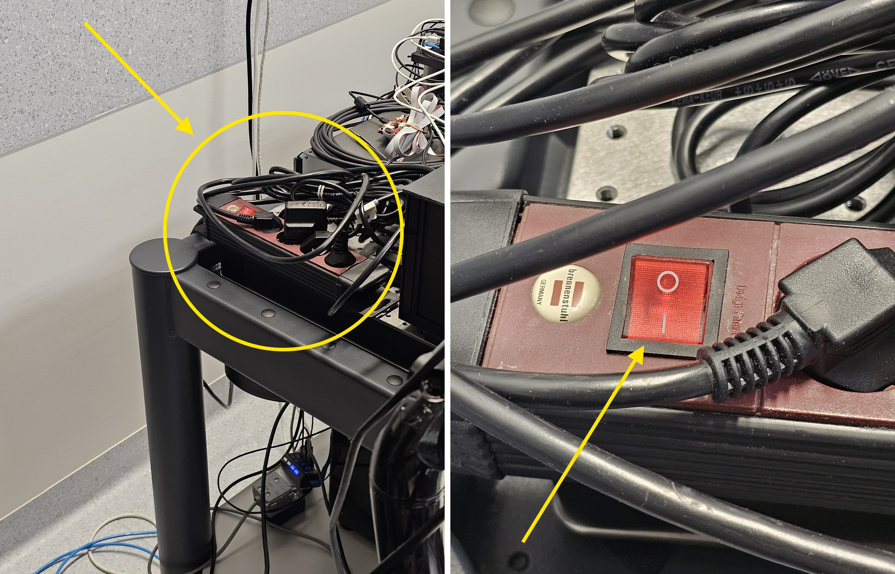 |

5. (`Optional`) Power on the `ThorLabs` red shutter control unit if the `561nm` laser line is being used.

   |              561 nm Laser Shutter               |
   | :---------------------------------------------: |
   | 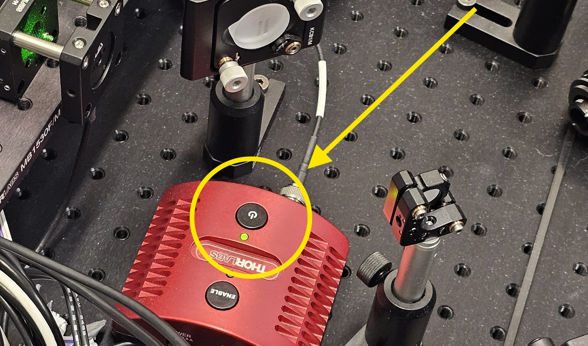 |

6. (`Optional`) Power on the multimode fiber agitation module if needed.

   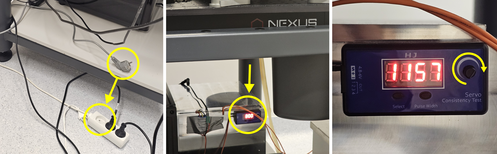

## Starting the microEye software

|             PC & Monitors             |
| :-----------------------------------: |
| 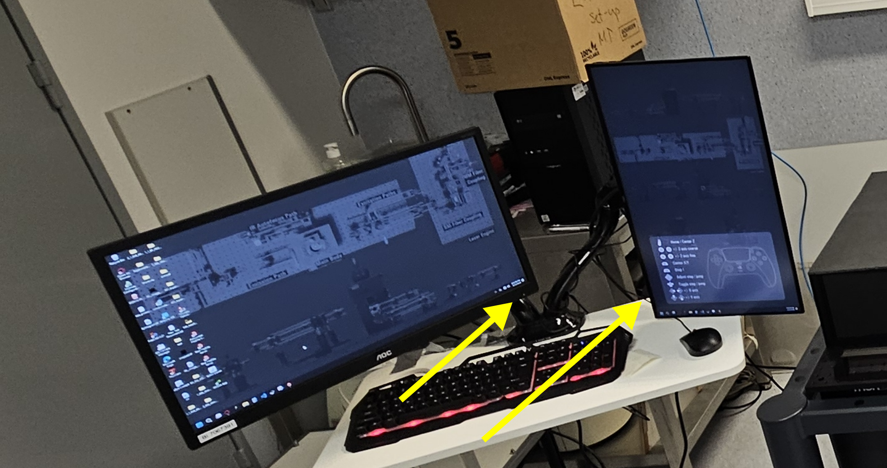 |

> [!TIP]
>
> - _The screens are turned off, make sure to turn them on if no output is visible._
> - _Turn on the PC if it is not running._

### 1. Starting the miEye module

To start from the `Shortcuts` folder:

1. Navigate to the `Shortcuts` folder located on the `Desktop`.
2. Double-click on the `launcher.bat` file to launch the microEye application.

3. Select `PyQt6` preferably or `PySide6` as the QT API and `qdarktheme` as the theme for better visual experience.

4. Select the `miEye Module` from the launcher interface to start the miEye module.

   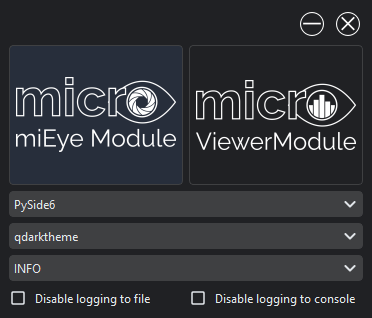 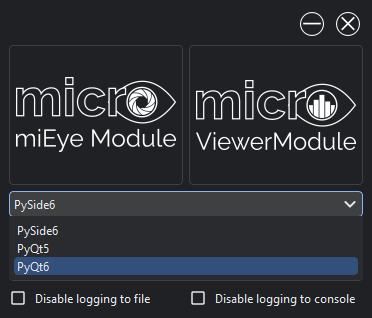

### 2. Loading configuration

1. Once the miEye module is launched, you will see the main interface of the miEye software.

   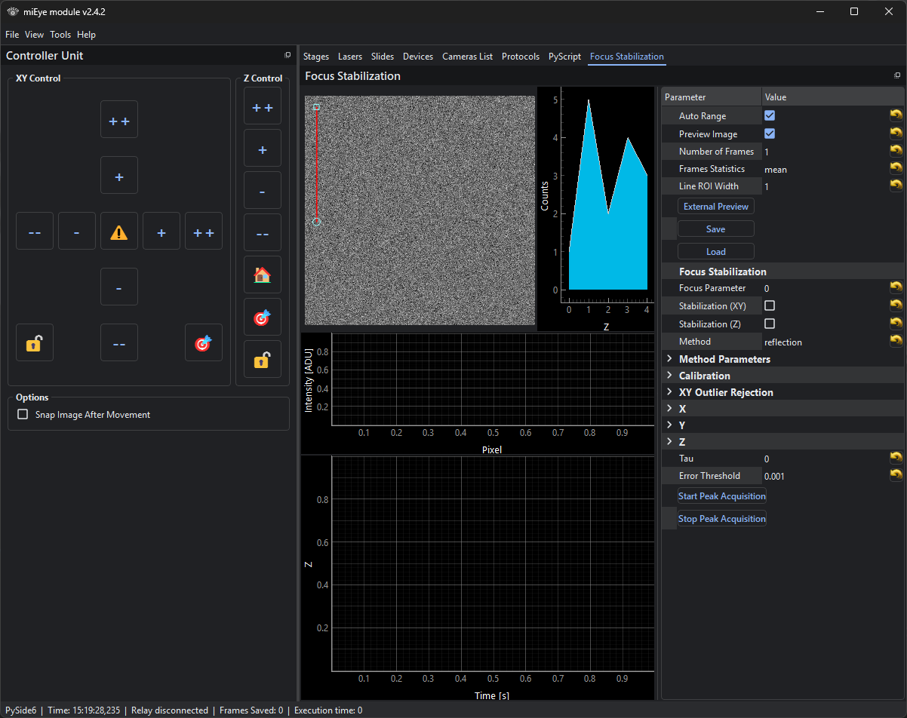

2. Navigate to the `File` menu and select `Load Config. & Connect` to load the microscope configuration file.

   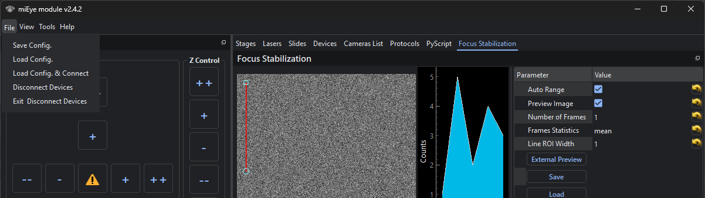

   > [!Note]
   > _The file `config.json` holds the last saved config, and should be located within the working directory where the `microEye` was launched._

   > [!Warning]
   >
   > _If any errors occur during loading or connecting it means some hardware is disconnected or not powered on most likely. Please check the hardware connections and power status before trying again._

   > [!IMPORTANT]
   > _If by mistake you press the `Save Config.` option, PLEASE REPORT IT IMMEDIATELY._

3. Wait till the GUI will be configured to repopulate the screen according to the previous saved layout.
   In our case, afterwards, we have to manually drag the acquisition camera interface to the `Portrait Monitor` from the `Landscape` one.

   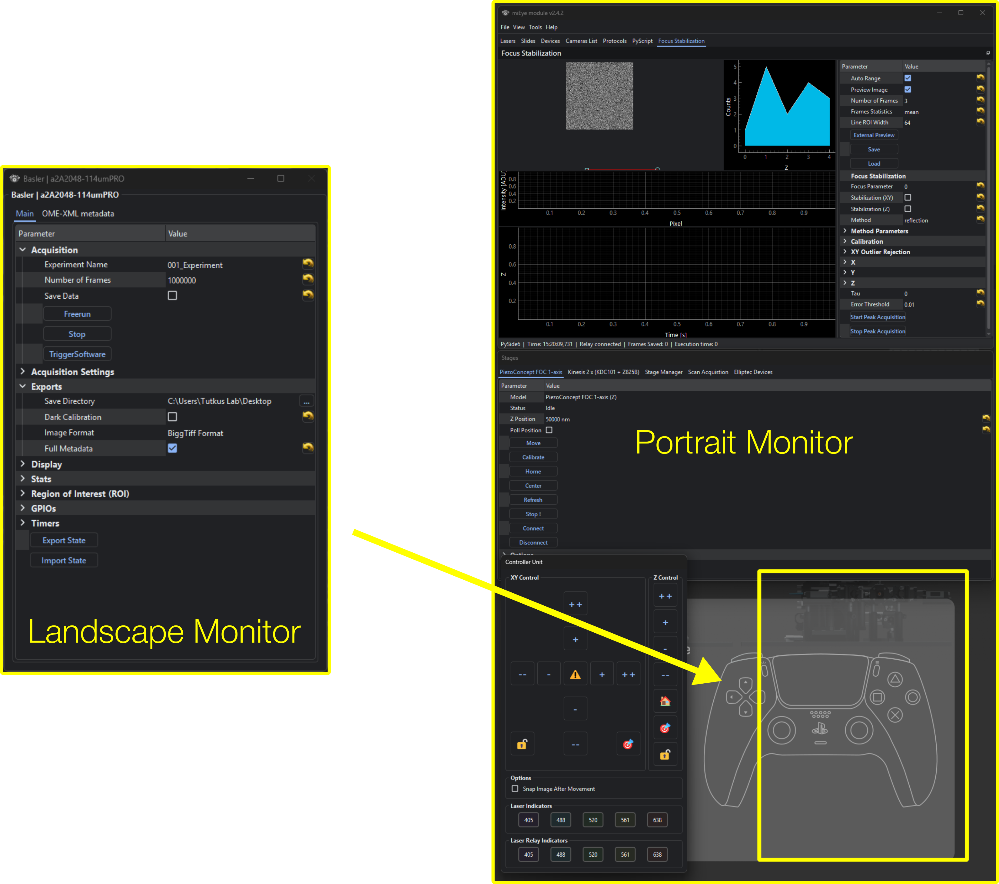

### 3. Setting up the Focus Stabilization NIR camera

1. Next navigate to the `Protocols` tab and right click and select `Import Execute` to import the NIR camera protocol file `Desktop/Shortcuts/Vimba_IR_cam_protocol.json`, used for focus stabilization.

   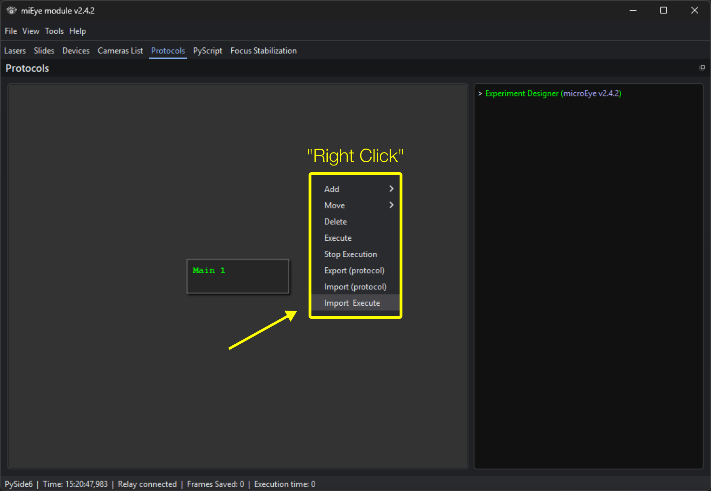

2. Wait till the execution is done.

   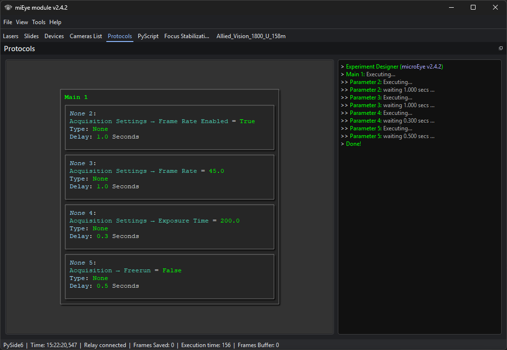

3. Navigate to the `Focus Stabilization` tab and make sure the camera view is being updated.

   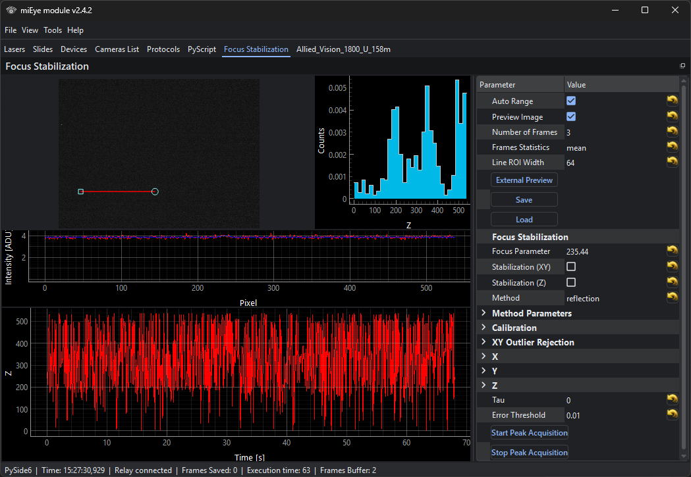

### 4. Setting up the Acquisition camera

1. Next, right click and select `Import Execute` to import the Acquisition camera protocol file `Desktop/Shortcuts/Basler_IMX900_config_prot_trigger.json`, used for setting up the acquisition parameters and triggers.

   

2. Wait till the execution is done.

   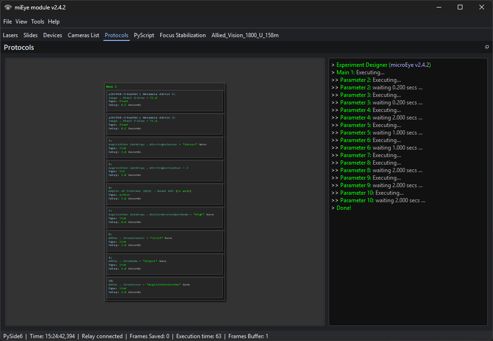

   > [!Tip] Tips
   > _For `Basler` camera, make sure:_
   >
   > - _That `Acquisition Settings -> binning` is set to `Sensor` and not `Region1` and `Acquisition Settings -> Horizontal` and `Acquisition Settings -> Vertical` binning are set to `2`. Otherwise, the camera will not be able to acquire images as intended to._
   > - _For laser triggering make sure `GPIOs -> line3` is set as `output` and `GPIOs -> Acquisition Active` is selected as the source._

3. Navigate to the acquisition camera window and right click to view the camera shortcuts popup menu:
   - Set the `Display Mode` to `Export ROIs`.
   - In `ROI Controls`, set the field of view to `38 um` instead of `100 um`.
   - Press `Dual View` to apply the changes.

   This will set the acquisition camera field of view to `38 um` per channel and display separate views for each ROI (channel).

   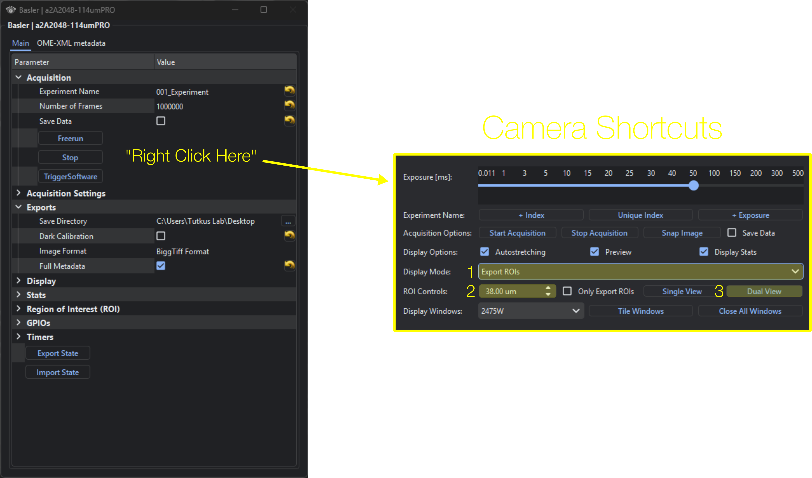

   > [!Tip] Tips
   >
   > - _`Start Acquisition` free-runs the camera till the specified number for frames._
   > - _Press `Tile Windows` to tile the acquisition ROI windows for better visualization, as by default they instantiate over each other._

4. Finally, the both screens should look something like this:

   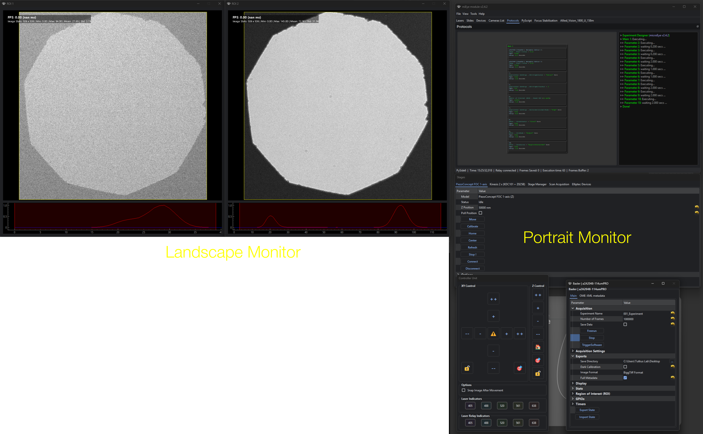

### 5. Microscope stages

> [!Warning]
> _Before homing/centering the XY stage, ensure the manual or motorized Z sample holder is fully retracted vertically to avoid any potential collisions with the objective lens._

1. Navigate to the `Stages` > `PiezoConcept FOC 1-axis` tab and click on the `Home` or `Center` button to home the objective `Z Stage`. The position should be 50000 nm after homing/centering.

   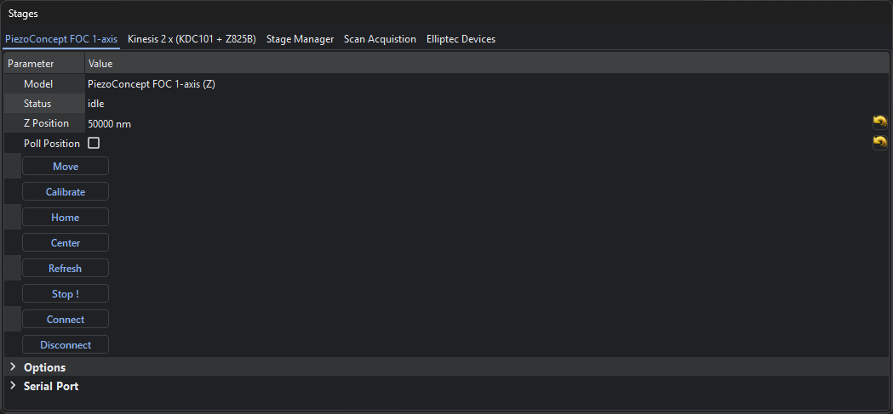

2. Next, click on the `Home` button to home the `XY Stage` called `Kinesis 2 x (KDC101 + ZB825B)`. Wait for the stage status to become `Idle`, the position should be (0, 0) after homing. Then click on the `Center` button to move the stage to the center of its range, the position should be (17 mm, 17 mm) after centering.

   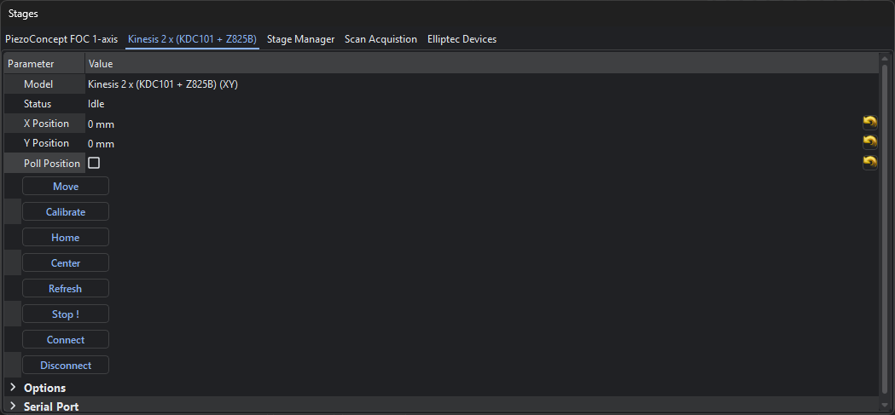

3. Navigate to the `Stages` > `Stage manager` and adjust step and jump sizes for each axis if needed. Step is denoted by `+/-` buttons and jump is denoted by `++/--` in the `Controller Unit` stage buttons.

   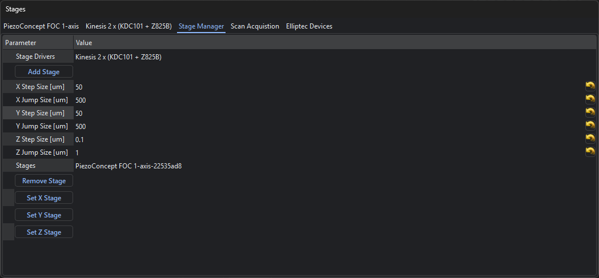

4. Navigate to the `Stages` > `Elliptec Devices` to scan for motorized shutters. Set `Range (max)` to `3` and press `Scan Devices`, three `ELL6` connected devices should show up.

   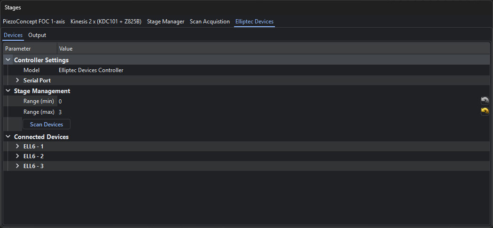

   > [!Tip]
   >
   > _Expand all Ell6 and press `Home`._

   > [!Note] Information
   >
   > _**ELL6 - 1**: Bertrand lens to see the back focal plane;_
   >
   > _**ELL6 - 2**: filter stage for `channel 1` or `ROI 1`;_
   >
   > _**ELL6 - 3**: filter stage for `channel 2` or `ROI 2`._

## Laser Excitation Guide

The `miEye` setup features two modes of excitation:

- Single-mode fiber (SMF) Excitation: a single-mode laser beam with two available expansions, 3X and 17X, used for Epi/HiLo/TIRF illumination.
- Multi-mode fiber (MMF) Excitation: a time-integrated, uniform excitation profile, free of speckle, achieved by mechanically agitating the fiber.

  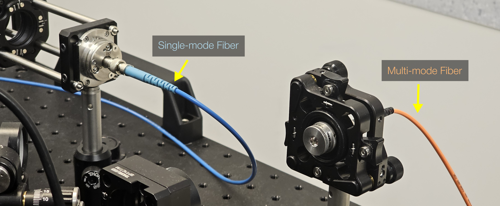

  > [!Warning]
  > _Before continuing, ensure all lasers are turned `OFF` or that camera acquisition is halted since its `GPIO` controls laser triggering._

  > [!Important]
  >
  > - _Switching between modes involves manually attaching or detaching a pair of mirrors from their magnetic mounts. Remember to wear gloves and avoid touching the optical surfaces._
  > - **_DO NOT CHANGE OR ADJUST ANY OPTICAL OR OPTOMECHANICAL ELEMENT IN THE SETUP NOT SPECIFIED IN THE GUIDE._**
  > - **_DO NOT LOOK STRAIGHT INTO THE LASERS, OBJECTIVE, OR ANY BEAM SOURCE (EVEN IF WEARING SAFETY GLASSES), AND AVOID ALIGNING YOUR EYES WITH THEM._**

### Switching SMF to MMF

1. To switch the laser engine coupling from SMF to MMF insert the mirror as shown in the image below.

   

2. To switch the microscope from SMF to MMF illumination insert the mirror as shown in the image below.

   

3. Turn on the MMF agitation module and set its RPM anywhere above or equal to `1150`.

   

> [!TIP] Tips
>
> - _The mirrors are typically left in the periphery of their respective mounting location._
> - _Trace back these steps in reverse to switch from MMF to SMF._

> [!Warning] Warnings
>
> - _Avoid mixing up the mirrors since they look the same._
> - _Handle optics wearing gloves._
> - _Avoid leaving the setup with only one Mirror installed. Either have both Mirrors installed or none at all._

### Single-mode fiber (Epi/HiLo/TIRF)

To switch between `Epi`, `HiLo`, and `TIRF` modes, manually rotate the kinematic adjustment knob illustrated below to change the beam's angle of incidence.

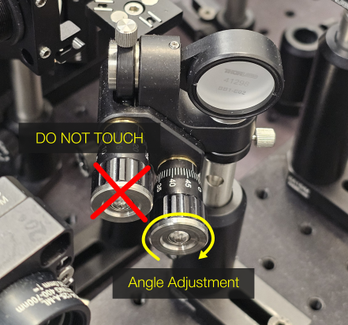

> [!Warning] Warnings
>
> - _When switching between `Epi` and `TIRF`, make sure the beam tilts toward the wall and back, but not toward the user._
> - _Whenever unsure, consult a more experienced colleague to clarify any ambiguities the guide might have missed._

### Single-mode fiber Expansion

#### High Expansion

1. Remove the magnetically mounted low expansion lens, marked `B` in the photo above, into the telescope.
2. Install the magnetically mounted high expansion lens, marked `A` in the photo above, into the telescope.

#### Low Expansion

1. Remove the magnetically mounted high expansion lens, marked `A` in the photo above, into the telescope.
2. Install the magnetically mounted low expansion lens, marked `B` in the photo above, into the telescope.

> [!warning]
>
> _Always ensure at least one lens (`A` or `B`) is attached to the telescope. Failing to do so could damage your eyes, camera, or bleach your sample, though the latter is less of a concern._
>
> 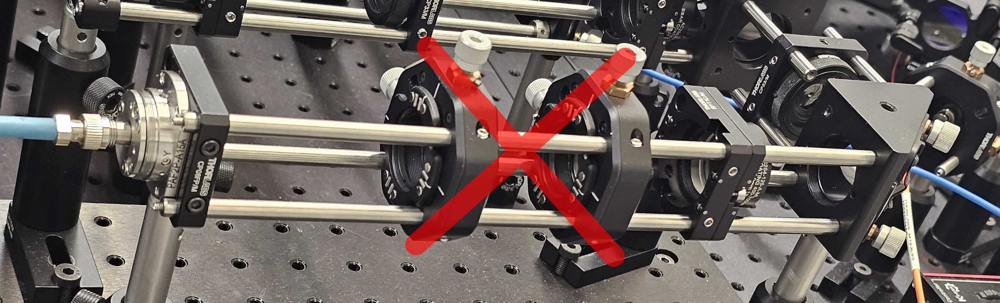

### Laser Control

Currently, the `miEye` setup is using a laser engine with the following laser devices:

|                                 |      Laser #1      |   Laser #2    |  Laser #3   |
| :-----------------------------: | :----------------: | :-----------: | :---------: |
|         **Laser Type**          |    Laser Diodes    | Laser Diodes  | OPSL / DPSS |
| **Available Wavelengths [nm]**  | 638, 520, 488, 405 | 520, 488, 405 |     561     |
|    **Used Wavelengths [nm]**    |        638         | 520, 488, 405 |     561     |
| **Laser Power/Current Control** |        Yes         |      Yes      |     N/A     |
|   **$\mathrm{I_{th}}$ [mA]**    |         90         |  40, 35, ??   |     N/A     |
|           **Shutter**           |     Electronic     |  Electronic   |  Motorized  |

**Laser States:** Each laser wavelength has four available states, when selected on the interface:

| Interface Laser State |  Laser   | LR(`OFF`) | LR(`ON`) | LR(`F1`) | LR(`F2`) |
| :-------------------: | :------: | :-------: | :------: | :------: | :------: |
|         `OFF`         | disabled |    :x:    |   :x:    |   :x:    |   :x:    |
|         `ON`          | enabled  |    :x:    |  :bulb:  | :camera: | :camera: |
|         `F1`          | enabled  |    :x:    |  :bulb:  | :camera: | :camera: |
|         `F2`          | enabled  |    :x:    |  :bulb:  | :camera: | :camera: |

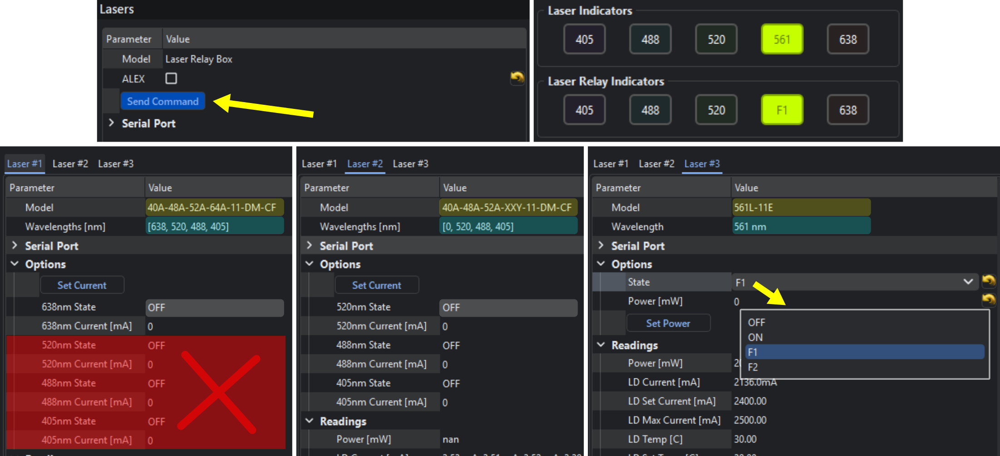

The `Laser Relay` (LR) is an Arduino device that relays camera trigger signals to control the laser output.

The `Send Command` is persisted in the laser relay's non-volatile memory, and has to be updated for the desired laser control behavior.

> [!note]
> _The `Send Command` is highlighted in:_
>
> - _`Blue` when the interface and relay settings are matching._
> - _`Black` when the interface and relay settings are mismatching._

> [!note]
>
> :x: - _Laser OFF_
>
> :bulb: - _Laser ON_
>
> :camera: - _Laser ON if camera trigger source is active._
>
> _Note that `F1` is the first camera's TTL output connected to the laser relay, while `F2` is the second camera's output._
>
> _Since we have one camera, `F2` TTL signal is always LOW/OFF._

> [!important] 561 nm (Laser # 3)
>
> - _Requires at least one hour of being `ON` to reach good stability_.
> - _Since it must always be enabled, we switch it off during acquisition by selecting `F2`_.
> - _Do not adjust or set the laser POWER! It will make the laser destabilize or shutdown._

> [!Warning] 638 nm (Laser # 1)
> _Only use `638 nm` and avoid using the other wavelengths (`520 nm`, `488 nm`, `405 nm`) as they are not coupled into the system._

## Sample Handling

### Slides

This control displays the `XY stage` position on the mounted sample slide. The context menu allows users to switch between different slide layouts. Clicking a numbered channel or well displays a prompt asking whether the user wants to move the `XY stage` to that spot.

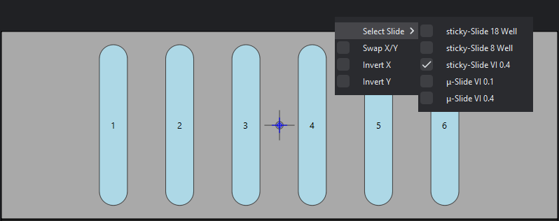

> [!note]
>
> _The inversion and axis swap options in the context menu are intended for specific cases and setup with the microscope configuration, and the end user does not need to modify them._

### Mounting

1. Raise the sample stage to its mid-range or highest point.
2. Add immersion oil or top it up if needed.

   > [!warning]
   >
   > - _Insufficient oil can result in sample breaks or a collision with the objective (See [Objective Care](#microscope-objective-care))._
   > - _Using excessive oil is generally discouraged, but it may be necessary for large-area scans._

3. Add your sample and secures it with four magnet cubes as illustrated below.

   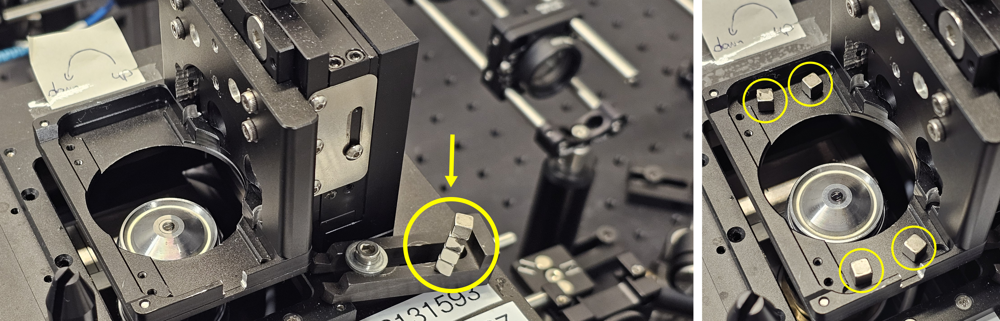

4. Move the `XY Stage` to match your channel/well using the stage controls, or use the `Slides` tab to select the channel/well and align it with the objective.

   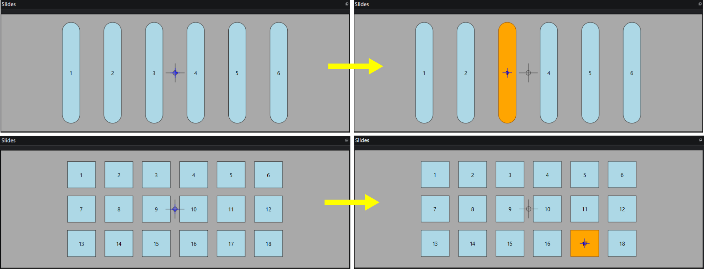

5. Carefully lower your sample till it makes contact with the immersion oil meniscus, then stop.

   > [!Warning] STOP & READ ME !!!
   >
   > - _If you are imaging a fluidic channel or well that is **DRY/EMPTY**, you have only a glass-air interface, so you won't see the back reflection in the next step._
   > - _Stop here, add media to your sample according to your protocol, then proceed._

6. Look at the `Focus Stabilization` tab and slowly lower the sample with fine increments till you see the NIR peak on the line profile like show below.

   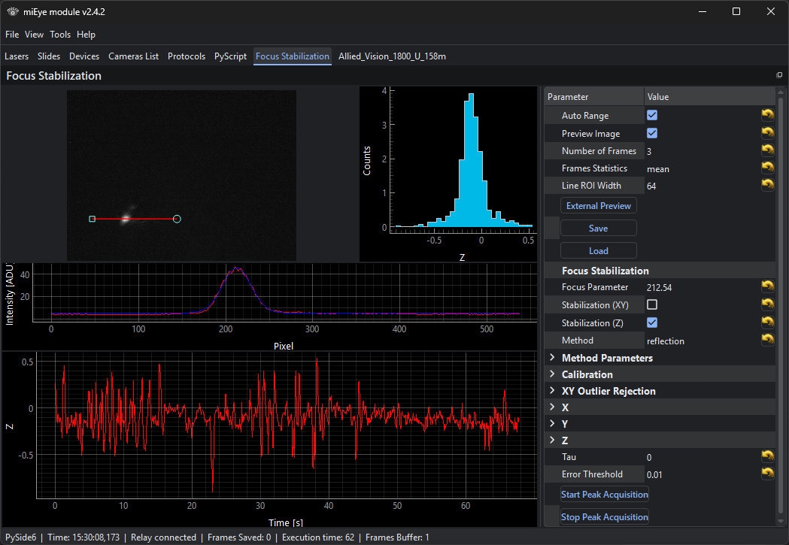

### Removing

1. Ensure focus stabilization is turned off.

   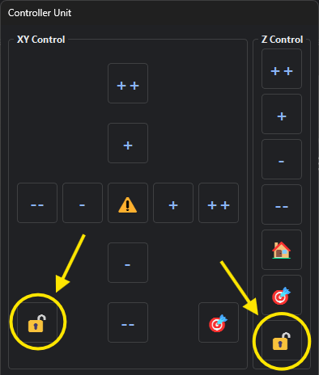

2. Raise the sample stage to its highest point to break the oil contact with the objective.

   > [!important]
   > _This prevents collisions when the XY stage moves to its homing position in the next steps._

3. Take out the magnets holding the sample and place them back in their designated spot where you found them.

   

4. Then, lift the sample off.

5. Clean the objective: As shown in the [objective care](#cleaning-the-oil-objective) section.

## Focus Stabilization

> [!note] TBA
>
> _Ask your colleagues for help._

## Scan Acquisition

> [!note] TBA
>
> _Ask your colleagues for help._

## Microscope Objective Care

> [!warning] Dry Immersion Media
> _How to clean objectives?_
>
> 
>
> - _We use 15% Isopropanol + 85% Petroluemether solvent mix for cleaning oil immersion objectives._
>
>   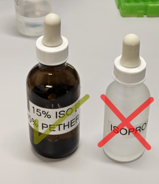
>
> - _First optical tissue is used to remove the oil without a solvent drop._

> [!warning] Collisions & Scratches
> 

> [!warning] Sample Breaks and/or Leaks ...
>
> _Immediately remove the sample then dry and clean the objective with optical tissue!_

### Cleaning the oil objective

The Oil immersion objective must be cleaned after use.

1. Lower the sample stage to reach the top surface of the objective.
2. Find the cleaning sheets for the microscope objective, cut into narrow, long strips.

   

3. Use the first strip, without adding a solvent drop, to wipe away the oil.
4. Have more 3-4 additional strips to clean the objective in a sliding motion, applying a solvent drop only at the start.

   > [!tip]
   > _Refer to the video above for a visual demonstration, or ask a colleague._

5. Raise the sample stage back to its highest point.

## Switching Off the Microscope

1. Ensure focus stabilization is turned off.

   

2. Remove the sample: As shown in the [Sample Handling](#removing) section.

3. Clean the objective: As shown in the [objective care](#cleaning-the-oil-objective) section.

4. Home both Z and XY stages.

5. Close the `microEye` Software using the `Exit Disconnect Devices` option from the file menu.

   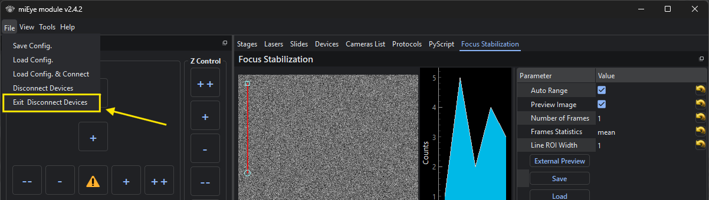

   > [!tip]
   > _All of these windows should be closed manually if present after the `Exit Disconnect Devices` button is pressed._
   >
   > 

6. To turn off the multimode fiber agitation module, rotate the knob counter-clockwise till it shows `800`, and then unplug it from the power socket.

   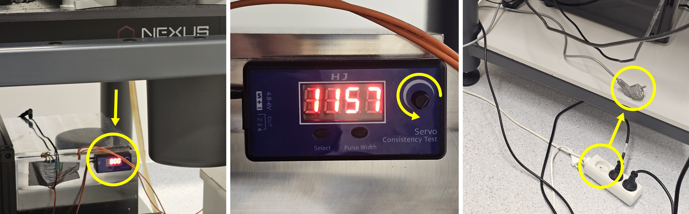

7. Flip the extension cord's power switch to power off all the microscope hardware.

   |                 Power Switch                  |
   | :-------------------------------------------: |
   |  |

8. Disconnect the three USB cables to the back of the microscope PC, as indicated by the yellow arrows in the photo below.

   |               USB Cables               |
   | :------------------------------------: |
   |  |
   - `Allied Vision` NIR camera for focus stabilization. (`Blue cable`)
   - `Basler` acquisition camera. (`Black cable`)
   - `Laser Relay` for laser triggering. (`White cable`)

9. Press the button below the standby text on the screen to stop the chiller's circulation.

10. Power off the chiller by flipping the black switch shown in the photo below.

|           Standby VS Running           |
| :------------------------------------: |
|  |

## Troubleshooting & FAQs

> [!warning] Basler's Camera -> Field of View Looks Weird
>
> - _Make sure that `Acquisition Settings -> binning` is set to `Sensor` and not `Region1` and `Acquisition Settings -> Horizontal` and `Acquisition Settings -> Vertical` binning are set to `2`._
> - _You may need to remove the exported ROIs (`ROI -> Export ROIs -> Remove ROIs`) and reset the general ROI (`ROI -> Reset ROI`)._
> - _Please reset the field of view (FOV) for dual view, just as described in the initial instructions._

> [!warning] Basler's Camera -> Camera is Running / Lasers OFF
>
> - _First, make sure your laser states are correct and been sent to the laser relay._
> - _Next, make sure `GPIOs -> line3` is set as `output` and `GPIOs -> Acquisition Active` is selected as the source._
